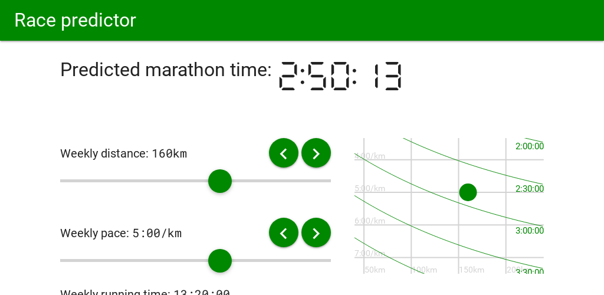

# FreshLegsMonday
A tool to predict a runner's marathon performance from their weekly training based on the Tanda formula

[FreshLegsMonday.com](https://FreshLegsMonday.com) is also available as both a PWA and Android app.

The Android app is available on Google Play and is a Trusted Web Activity (TWA) generated using [Bubblewrap](https://github.com/GoogleChromeLabs/bubblewrap).

The PWA (progressive web app) is [installable](https://support.google.com/chrome/answer/9658361) from [FreshLegsMonday](https://freshlegsmonday.com).

Additional [documentation](doc) in /doc.
